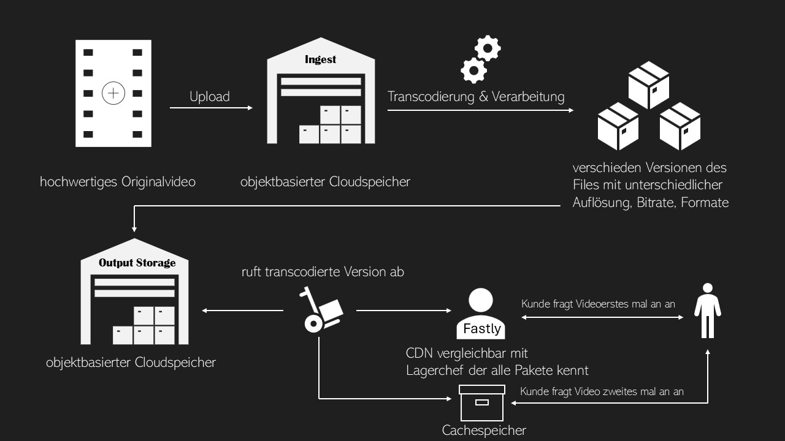
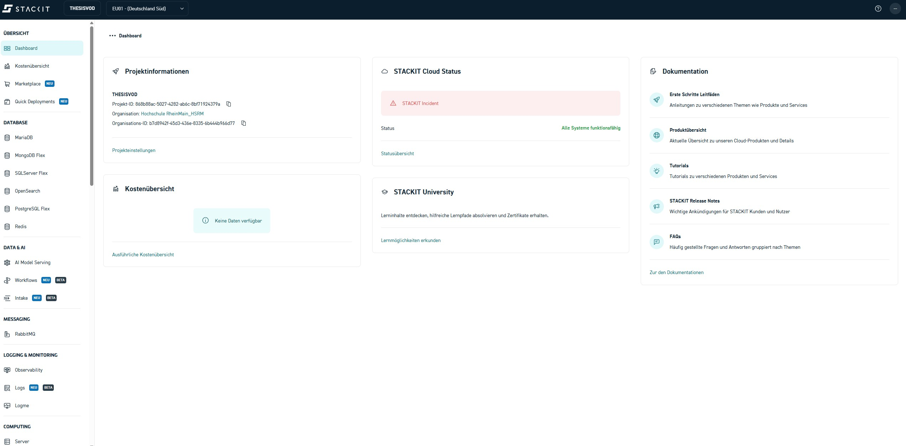

Video-on-Demand-Systeme (VoD) sind aus dem heutigen Medienalltag nicht mehr wegzudenken.
Plattformen wie YouTube, Netflix oder die Mediatheken von ARD und ZDF zeigen, wie
selbstverständlich audiovisuelle Inhalte jederzeit und auf unterschiedlichsten
Endgeräten verfügbar sind. Hinter dieser scheinbaren Selbstverständlichkeit verbirgt
sich jedoch ein komplexer technischer Workflow aus Speicherung, Verarbeitung und
Verteilung von Medieninhalten.

Der Aufbau eines VoD-Systems in der Cloud ist in den letzten Jahren deutlich vereinfacht
worden. Moderne Cloud-Plattformen stellen skalierbare Infrastrukturen bereit, mit denen
große Mediendaten effizient ingestiert, gespeichert, transcodiert und ausgeliefert
werden können. In diesem Praktikum wird dieser Workflow praxisnah nachvollzogen – jedoch
bewusst nicht mit proprietären Komplettlösungen eines einzelnen Hyperscalers.

Stattdessen liegt der Fokus auf einem herstellerneutralen Ansatz unter Verwendung der
europäischen Cloud-Plattform **STACKIT** in Kombination mit dem Content Delivery Network
**Fastly**. Dadurch wird nicht nur ein realistischer und übertragbarer VoD-Workflow
vermittelt, sondern auch ein Bewusstsein für Themen wie digitale Souveränität,
Datenhoheit und den Einsatz europäischer Cloud-Infrastrukturen geschaffen.

## Einfaches Beispiel

Ein Video-on-Demand-Workflow lässt sich gut mit einem modernen Paketversand vergleichen.
Zunächst wird ein hochwertiges Originalvideo in das System hochgeladen und sicher
gespeichert – vergleichbar mit der Abgabe eines Pakets in einem zentralen Lager. Dieses
Original dient als Ausgangspunkt für alle weiteren Verarbeitungsschritte.

Da unterschiedliche Endgeräte unterschiedliche Anforderungen haben, wird das Video
anschließend in mehrere optimierte Versionen umgewandelt. Ähnlich wie ein Paket je nach
Empfänger neu verpackt wird, entstehen so verschiedene Videoformate für Smartphones,
Tablets oder große Bildschirme. Dadurch kann sichergestellt werden, dass Inhalte
unabhängig von Gerät und Netzwerkbedingungen effizient und in gleichbleibender Qualität
ausgeliefert werden.

Um eine schnelle und zuverlässige Bereitstellung für viele Nutzer gleichzeitig zu
ermöglichen, werden diese Videoversionen schließlich über ein Content Delivery Network
möglichst nah an die Nutzer verteilt. Dies reduziert Ladezeiten, entlastet zentrale
Server und verbessert die Nutzererfahrung.

Der Nutzer selbst erhält das Video über einen Browser oder Mediaplayer, ohne die
zugrunde liegende Infrastruktur wahrzunehmen – für ihn zählt lediglich, dass die
Wiedergabe schnell, stabil und ohne Unterbrechungen startet.

## Fastly als Content Delivery Network

Fastly wird in diesem Versuch als Content Delivery Network (CDN) eingesetzt und
übernimmt die performante Auslieferung der transcodierten Medieninhalte an die
Endnutzer. Ein CDN besteht aus einer Vielzahl weltweit verteilter Server, die Inhalte
möglichst nah am jeweiligen Nutzer bereitstellen.

Im vorliegenden Workflow dient der STACKIT Object Storage als sogenannte Origin-Quelle.
Fastly greift bei der ersten Anfrage auf die dort abgelegten Medieninhalte zu und
speichert diese temporär in seinem Cache. Nachfolgende Anfragen können direkt von einem
nahegelegenen Edge-Server bedient werden, ohne erneut auf den Origin-Speicher zugreifen
zu müssen.

Dieser Ansatz entlastet den Ursprungsspeicher, verbessert die Skalierbarkeit des Systems
und sorgt für eine stabile Nutzererfahrung.

## Workflow

Unabhängig vom eingesetzten Cloud-Anbieter folgt der Distributionsweg von
Video-on-Demand-Systemen in der Regel einem ähnlichen Grundprinzip. Zunächst werden
hochwertige Quelldateien in das System ingestiert und in einem nicht öffentlich
zugänglichen Speicher abgelegt.

Abhängig vom vorgesehenen Distributionsweg werden diese Quelldateien anschließend in
verschiedene Zielformate transcodiert, um eine optimale Wiedergabe auf unterschiedlichen
Endgeräten und Netzwerkbedingungen zu ermöglichen.

Nach Abschluss der Transcodierung werden die Medieninhalte über ein Content Delivery
Network (CDN) verteilt, das eine performante und skalierbare Auslieferung an eine große
Anzahl von Nutzern ermöglicht.

In der Praxis wird dieser Ablauf durch Monitoring-, Automatisierungs- und
Benachrichtigungsmechanismen ergänzt.

## Cloud-Anbieter

Cloud-Anbieter stellen Rechen-, Speicher- und Netzwerkressourcen über das Internet
bereit. Anstatt eigene Hardware zu betreiben, nutzt der Anwender diese Ressourcen
bedarfsgerecht und zeitlich begrenzt.

Die angebotenen Dienste lassen sich grob in drei Kategorien einteilen:

**Infrastructure as a Service (IaaS)**  
Bereitstellung grundlegender Infrastruktur wie virtuelle Maschinen, Netzwerke und
Speicher.

**Platform as a Service (PaaS)**  
Bereitstellung abstrahierter Plattformdienste wie Object Storage oder
Container-Orchestrierung.

**Software as a Service (SaaS)**  
Bereitstellung vollständig betriebener Anwendungen[^1].

ℹ️
    Für die folgenden Versuche werden Dienste der STACKIT-Cloud für Speicherung,
    Verarbeitung und Monitoring sowie das Content Delivery Network (CDN) von Fastly
    verwendet.

### Weboberfläche

Cloud-Produkte lassen sich in der Regel über eine grafische Weboberfläche verwalten.
Bei STACKIT erfolgt der Zugriff über das STACKIT Portal.

### Kommandozeile

Neben der grafischen Oberfläche können Cloud-Ressourcen auch mithilfe von
Kommandozeilenwerkzeugen (CLI) und Skripten verwaltet werden.

