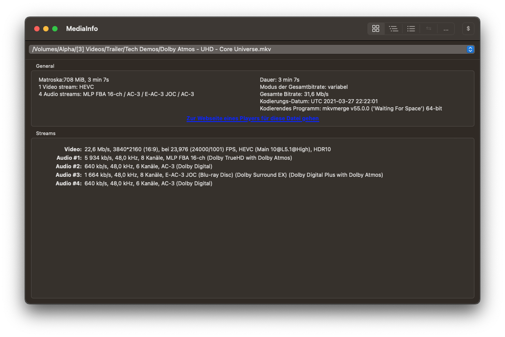

# Praktische Übung mit STACKIT und Fastly

## Ablauf der praktischen Übung

Der Fokus liegt auf der Untersuchung cloudbasierter Video-Transcoding- und Content-Auslieferungs-Workflows unter Nutzung von:

- STACKIT Object Storage  
- FFmpeg  
- Fastly Content Delivery Network  

---

## Versuche

Die praktische Übung besteht aus drei Versuchen.

### 🔹 [Versuch 1 – Grundlagen cloudbasierter Transcoding-Workflows](versuch1/)
Einführung in den Aufbau eines VoD-Workflows, Einrichtung der Infrastruktur und erste Transcodierungsschritte.

### 🔹 [Versuch 2 – Content-Auslieferung über CDN](versuch2/)
Untersuchung der Auslieferung transcodierter Inhalte über ein Content Delivery Network.

### 🔹 [Versuch 3 – Automatisierter VoD-Workflow](versuch3/)
Konzeption und Umsetzung eines automatisierten End-to-End-Workflows.

---

## Zielsetzung

Ziel der Versuchsreihe ist es, ein fundiertes Verständnis für:

- Cloud-Architekturen im Medienbereich  
- Video-Transcoding-Prozesse  
- Skalierbarkeit und Performance  
- Europäische Cloud-Infrastrukturen  

zu entwickeln.

## Abgabe

Bewertet wird ein schriftlicher Versuchsbericht sowie die im Laufe der Versuchsdurchführung erzeugten Dateien. Der schriftliche Bericht sollte **grob 3 Seiten pro Versuch** umfassen und neben der Protokollierung der Versuchsdurchführung die in der Versuchsanleitung gestellten Fragen beantworten. 

Die Fragen sind in der Versuchsanleitung folgendermaßen gekennzeichnet:

!!! question "Beispielfrage 1"
    Beispiel-Fragestellung.

{==

** Mittels KI generierte Teile der Abgabe sind zu kennzeichnen, das verwendete LLM und der jeweilige Prompt sind anzugeben. 
Verstöße gegen die Kennzeichnungspflicht führen zur Bewertung der praktischen Übung mit null Punkten**

==}


### Abgabeort

Die Abgabe des Berichtes zur praktischen Übung erfolgt via ILIAS. Der Bericht soll nach dem folgenden Schema benannt sein: 

`[Matrikelnummer] - [Nachname]_[Vorname] - Versuchsbericht.pdf`

Die abzugebenden Dateien sollen in Ihr S3-Bucket hochgeladen werden. Pro Versuch soll für die Abgaben ein eigener Ordner Versuch1, Versuch2 etc. erstellt werden. 

Im Fazit jedes Kapitels sind die Dateien genannt, die mindestens abgegeben werden müssen. Eigene Experimente mit z.B. kreativen Kodiereinstellungen etc. sind erwünscht. Wenn weitere Dateien auf S3 verbleiben, kopieren Sie diese bitte in einen Unterordner "Experimente".

<u>Beispiel:</u>

```
📁 
    📁 Versuch1
        📄 Clip1_720p.mp4
        ...
    📁 Versuch2
    📁 Versuch3
    📁 Versuch4
    📁 Versuch5
```

!!! warning "Warnung"
    Dateien, die sich nicht im Abgabeordner befinden, werden bei der Bewertung nicht berücksichtigt.

### Bewertungskriterien

Zur Bewertung werden der Bericht, die darin beantworteten Fragen, sowie die abgegebenen Dateien herangezogen. Neben faktischer Korrektheit sollte ebenfalls auf die Rechtschreibung und Form (z.B. Quellenangaben) geachtet werden.

## Benötigte Software

Für die Versuche ist nur wenig Software auf dem lokalen Rechner von Nöten, da auf STACKIT und Fastly über ein Webinterface zugegriffen wird. Zur Beurteilung der Dateien sind jedoch einige Programme notwendig. 

Alle Programme sind sowohl für Windows und MacOS, als auch für diverse Linux-Distributionen erhältlich.

### Mediaplayer

Zur Wiedergabe von transcodierten Videodateien sollte ein aktueller Mediaplayer vorhanden sein. Empfohlen wird [VLC Mediaplayer](https://www.videolan.org/vlc/index.de.html) oder [mpv](https://mpv.io/).

### MediaInfo

Um die technischen Metadaten der Videodateien auszulesen, wird [MediaInfo](https://mediaarea.net/en/MediaInfo) benötigt.


