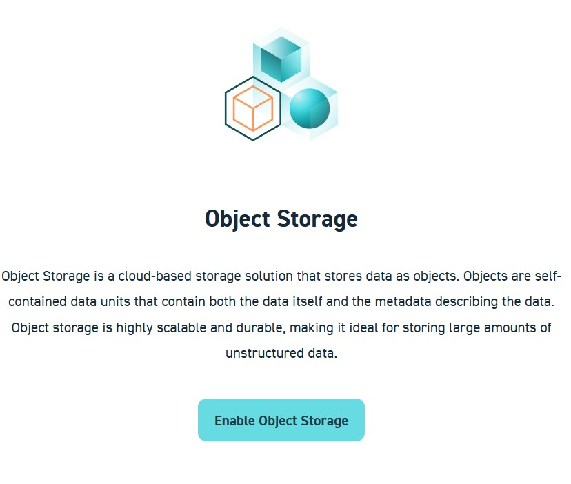
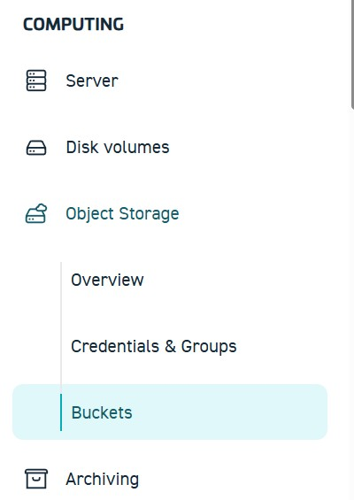
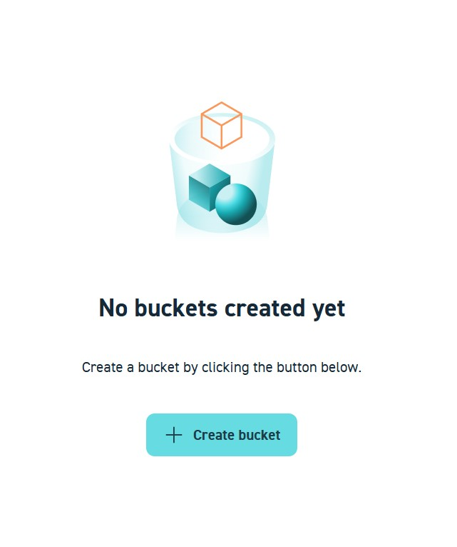
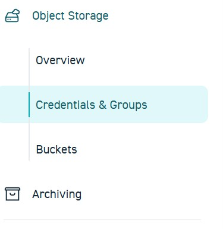
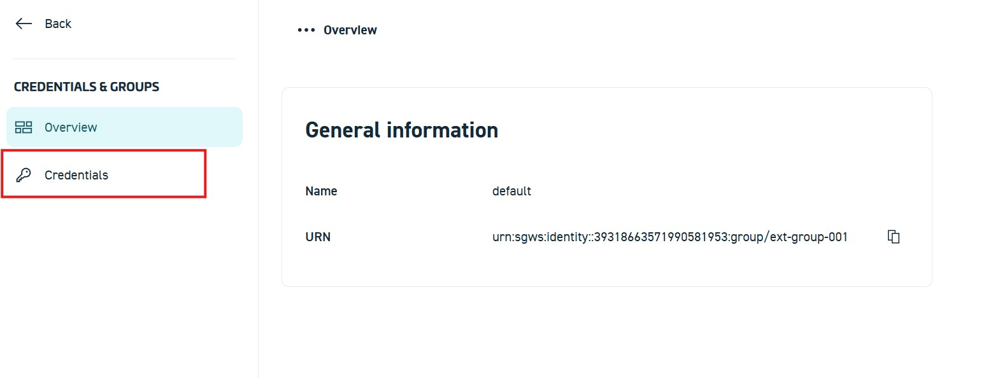

# STACKIT Object Storage

Zuerst wird der Speicherort für die transcodierten Dateien angelegt.  
Dazu wird der **STACKIT Object Storage** verwendet, ein S3-kompatibler Objektspeicher.

**Der Zugriff erfolgt über das STACKIT Portal im Browser. Auf der rechten Reiterseite. Hier findet man unter dem Reiter Computing den Unterpunkt "Object Storage"**

**Hier muss der Objektspeicher manuell aktiviert werden. Hierfür muss nur der vorhandene Button "Objektspeicher aktivieren" geklickt werden.**

**Nun bitte zu dem Unterreiter Buckets navigieren**

!!! question "Frage 1.1"
    Wie erklären Sie sich, dass auch der Cloud-Anbieter STACKIT das S3-Protokoll für seinen Object Storage nutzt?

    Finden Sie die Spezifikation des S3-Protokolls und recherchieren Sie die Lizenzbedingungen.
  
**Klicken Sie auf das Feld "+ Bucket erstellen"**

Die Namensvergabe soll nach einem einheitlichen Schema erfolgen:  

`bucket-[HDS-Nutzername]`  Beispiel: `bucket-musterax`   

!!! info
    Notieren Sie sich alle im Projekt verwendeten <strong>Zugangsdaten</strong>, 
    <strong>Namen</strong> und <strong>Bezeichnungen</strong> (z. B. Bucket-Namen, 
    Benutzernamen oder Projektkennungen).  
    Diese Informationen werden benötigt, um den Versuch später auch 
    <strong>außerhalb der Präsenzveranstaltung</strong> (z. B. von zu Hause aus) 
    weiterzuführen.

## Vorbereitung: Zugangsdaten (Keys) im STACKIT Control Center erstellen

Bevor Dateien hochgeladen werden können, müssen **Zugangsdaten (Keys)** für den Object Storage angelegt werden.  
Diese werden später in der Kommandozeile verwendet.

1. Navigieren Sie zu: Object Storage → Credentials & Groups

2. In der Übersicht werden die vorhandenen Credential Groups angezeigt. Standardmäßig existiert bereits eine Gruppe mit dem Namen default.

3. Öffnen Sie die Gruppe default, indem Sie diese anklicken.

4. Wechseln Sie innerhalb der Gruppe in den Reiter Credentials.

5. Klicken Sie auf Create Credentials und erstellen Sie neue Zugangsdaten.

Nach dem Erstellen werden **zwei Schlüssel angezeigt**:
- **Access Key** (öffentlicher Schlüssel)
- **Secret Key** (privater Schlüssel)

!!! info
    ⚠️ **Wichtig:**  
    Der **Secret Key wird nur einmal angezeigt**.  
    Notieren oder speichern Sie beide Keys sorgfältig. Diese werden im weiteren Verlauf der praktischen Übung benötigt.

