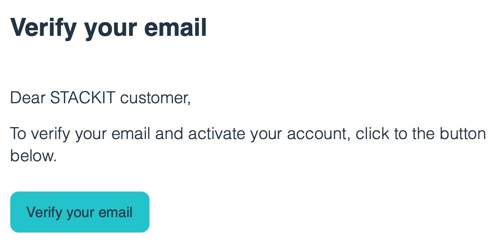
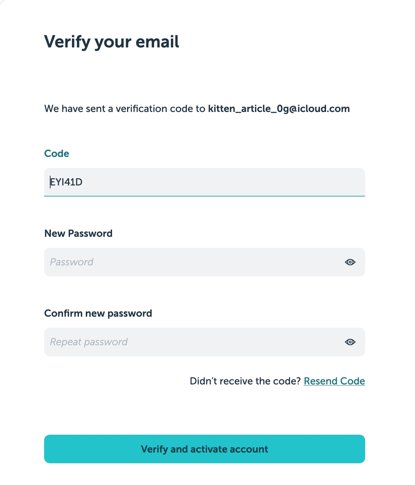
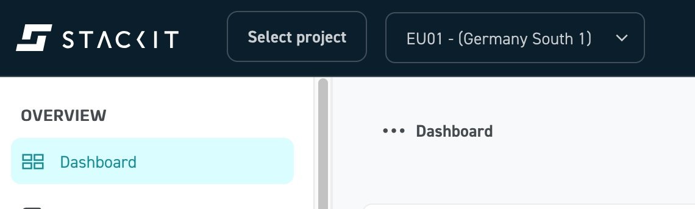
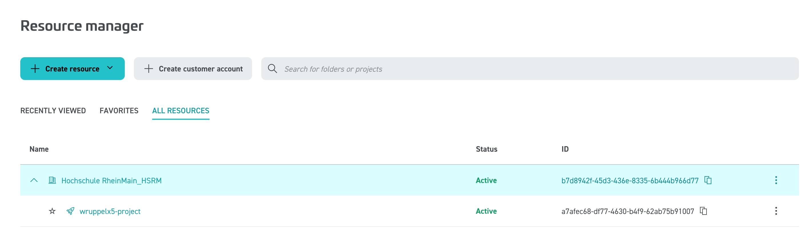
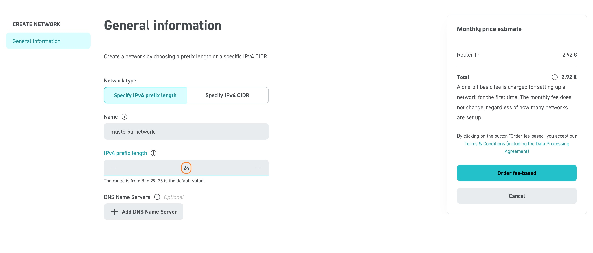

# Account aktivieren und Netzwerk anlegen

## Account aktivieren und Projekt auswählen

Für diesen Praktikumsversuch erhalten die Studierenden die benötigten Zugangsdaten (Credentials) per E-mail (SPAM-Ordner checken!) von STACKIT.
Folgen sie dem Link zur Aktivierung Ihres Accounts:

{ width="50%" }

**Der Benutzername ist Ihre studentische E-mail-Adresse**

Aktivieren Sie Ihren Account:

{ width="50%" }

**Nun wählen Sie auf der Landingpage in der oberen Leiste das bereits für Sie angelegte Projekte und die Region EU01 - (Deutschland Süd) aus.**

Ein "Projekt" bei STACKIT ist eine abgegrenzte Arbeitsumgebung im Rahmen einer Organsiation.
Sie haben "Owner"-Rechte in Ihrem Projekt und können damit Instanzen in allen STACKIT-Services anlegen, nutzen und auch löschen.

Klicken Sie auf "Select project":

{ width="50%" }

Dann auf "ALL RESOURCES":

Dort sollte Ihr Projekt mit der Bezeichnung [HDS-Nutzername]-project angezeigt werden. Falls nicht kontaktieren Sie bitte den Dozenten!

## Subnetz anlegen

Für die Instanzen, mit denen Sie im Rahmen dieser praktischen Übungen arbeiten, muss zunächst ein Netzwerk angelegt werden.

Achten Sie darauf, dass in der Statusleiste Ihr Projekt `[HDS-Nutzername]-project` und die Region `EU01` ausgewählt sind.

Wählen Sie dann im STACKIT Portal im Bereich "NETWORKING" den Eintrag "Network" aus, klicken Sie auf "Create Network" und tragen Sie folgende Parameter ein:

| Feld                           | Eingabe                                         |
|------------|-----------------------|
| Name | [HDS-Nutzername]-network |
| Netzmaske | 24 bit |

Klicken Sie anschließend auf "Order fee-based"

!!! question "Aufgabe 1.1"
    Dokumentieren Sie den Ihnen zugewiesenen Adressbereich, die Netzmaske, die konfigurierten DNS-Server sowie die Routing-Tabelle. 
    
