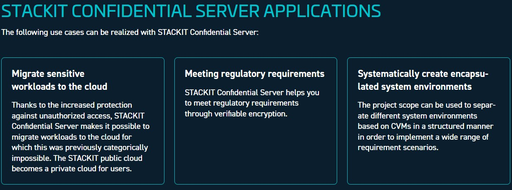
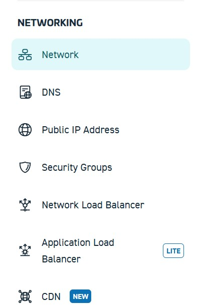
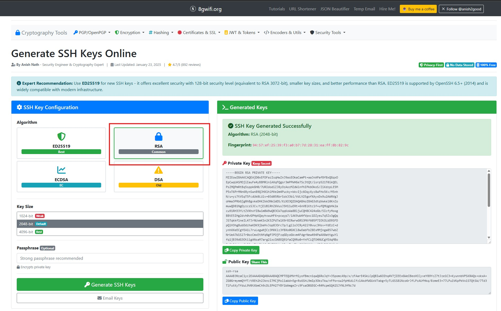
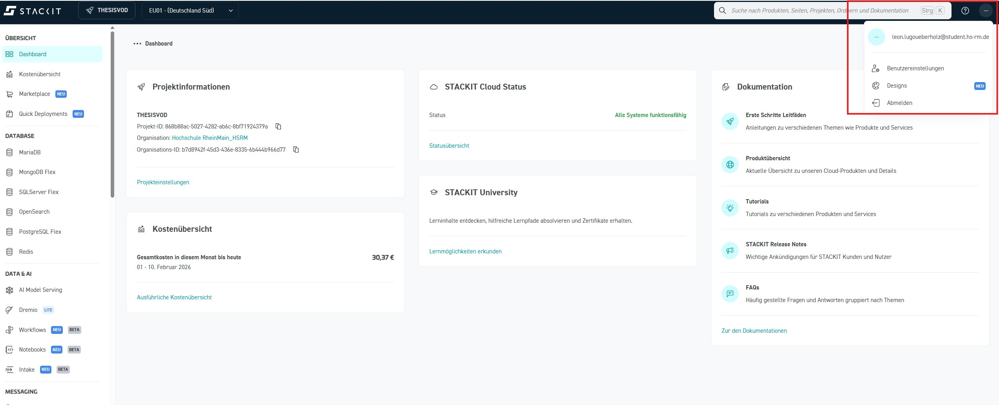
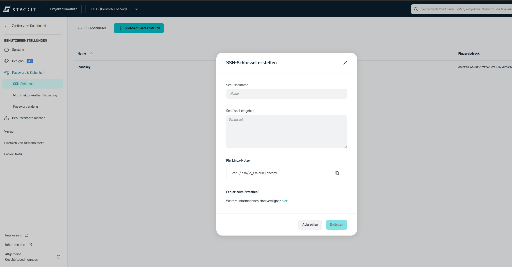
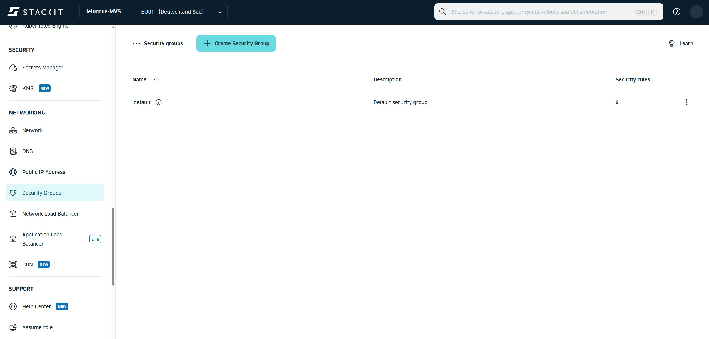
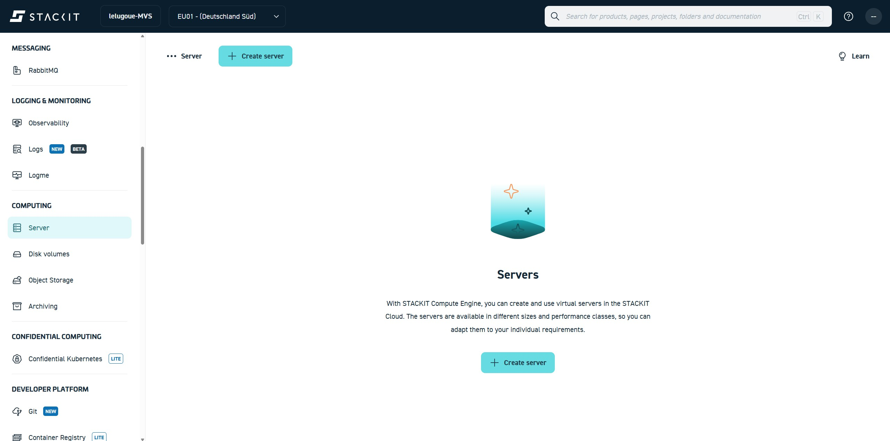
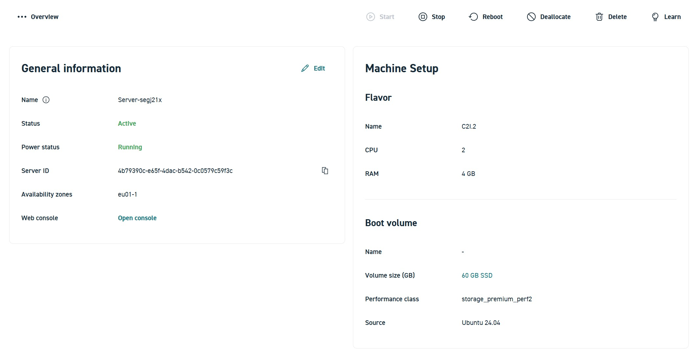
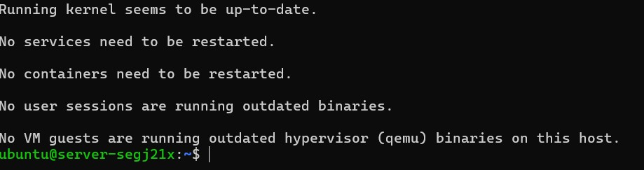
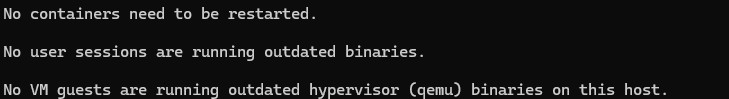

# Transcodierung über eine virtuelle Maschine (VM)

Im folgenden Abschnitt wird die **Transcodierung eines Videos mithilfe einer virtuellen Maschine (VM)** durchgeführt.  
Dabei wird ein zuvor in das Bucket hochgeladenes Video auf einer VM transcodiert. Das Ergebnis der Transcodierung wird anschließend wieder im Bucket abgelegt.

Die VM übernimmt in diesem Versuch die Rolle eines **Rechenknotens**, auf dem eine Transcoding-Software ausgeführt wird. Im Gegensatz zu vollständig verwalteten Cloud-Services bietet dieser Ansatz volle Kontrolle über:

- eingesetzte Software

- Transcoding-Parameter

- Ablauf des Workflows



## Ablauf im Überblick

Der Transcoding-Prozess besteht aus den folgenden Schritten:

1. **Bereitstellung der virtuellen Maschine**  
   Eine virtuelle Maschine (VM) mit Linux-Betriebssystem wird als Arbeitsumgebung eingerichtet.

2. **Einrichtung der Laufzeitumgebung **  
   Instalation der benötigten Anwendungen auf der VM.

3. **Transcodierung**  
   Mithilfe eines Kommandozeilenwerkzeugs (FFmpeg) wird eine MXF-Datei in ein Streaming-Format transcodiert.

4. **Rücktransfer der Ergebnisse**  
   Die transcodierte Videodatei wird in das Bucket hochgeladen und steht dort für die weitere Verarbeitung oder Auslieferung bereit.


## Netzwerk

**Für dieses Praktikum ist bereits ein virtuelles Netzwerk vorhanden, das verwendet werden soll.**

**Bitte navigieren Sie an der linken Seite zu Networking: > Network**



Bei der Erstellung von Rechenressourcen (z. B. Compute-Instanzen, Transcoder oder Services) wird dieses Netzwerk direkt ausgewählt.
Die jeweilige Ressource wird dadurch automatisch Teil des Netzwerks.

Eine separate Kopplung oder zusätzliche Konfiguration des Netzwerks ist nicht erforderlich.

!!! question "Frage 1.2"
    Dokumentieren Sie den Ihnen zugewiesenen Adressbereich, die Netzmaske, die konfigurierten DNS-Server sowie die Routing-Tabelle. 
    


## SSH-Schlüssel für den Serverzugang erstellen

Für den Zugriff auf den Linux-Server wird eine Anmeldung per **SSH-Schlüssel** verwendet. Dabei besteht ein Schlüssel immer aus einem **privaten** und einem **öffentlichen** Teil. In der STACKIT-Weboberfläche wird **nur der öffentliche Schlüssel** hinterlegt.

### Schritt 1: SSH-Schlüsselpaar erzeugen (plattformunabhängig)

Das SSH-Schlüsselpaar wird über den folgenden Online-Generator erzeugt:

[https://8gwifi.org/sshfunctions.jsp](https://8gwifi.org/sshfunctions.jsp){:target="_blank"}



1.Öffnen Sie die oben genannte Webseite.

2.Wählen Sie als Algorithmus RSA.

3.Erzeugen Sie ein neues Schlüsselpaar.

### Schritt 2: Key in STACKIT ablegen

Speichern Sie sowohl den Public Key als auch den Private Key lokal auf Ihrem Rechner, z. B. unter folgendem Namen:

```bash
pub-key-stackit.txt
priv-key-stackit.txt
```

Bei der Servererstellung kann hierfür später das erstellte Schlüsselpaar verwendet werden.

**Wichtig: Unter Linux und macOS müssen Sie die Zugriffsrechte auf die Datei, die den privaten Schlüssel enthält, ändern:**

```bash
chmod 400 <priv-key-file>
```

Um sich später mit der VM verbinden zu können, nutzen Sie folgenden Befehl:

```bash
ssh -i <priv-key-file> ubuntu@<public ip der vm>
```


### Schritt 3: Einrichtung des Keys auf der STACKIT Weboberfläche

Der öffentliche Schlüssel soll nun mit Ihrem STACKIT-Konto verknüpft werden.

**Navigieren sie hierzu  zu ihren Nutzereinstellungen:**

 

**Unter Passwort&Sicherheit finden Sie nun die Option "SSH-Schlüssel erstellen":**



**Geben Sie als Namen key-[HDS-Nutzername] ein. Zum Beispiel: *key-musterax***

**In das Feld Schlüssel kopieren Sie Ihren Public Key**

**Anschließend auf Create klicken**


## Security Group anpassen

### Konfiguration der Security Group für den SSH-Zugriff

Damit eine Verbindung zur virtuellen Maschine über SSH hergestellt werden kann, muss der entsprechende Netzwerkzugriff über Port 22 explizit erlaubt werden. In STACKIT erfolgt diese Zugriffskontrolle über sogenannte Security Groups. Security Groups definieren, welcher ein- und ausgehende Netzwerkverkehr für eine Ressource erlaubt ist.

Standardmäßig ist bei neu erstellten Servern kein externer Zugriff über Port 22 freigegeben. Aus diesem Grund muss vor dem ersten Login eine passende Regel ergänzt werden.

### Öffnen der Security Groups im STACKIT Portal

Der Zugriff auf die Security Groups erfolgt über das STACKIT Control Center.

Navigieren Sie in der linken Seitenleiste zu:

Networks → Security Groups



In der Übersicht wird mindestens eine Security Group mit dem Namen `default` angezeigt. Diese Security Group ist in der Regel bereits dem Server zugewiesen und kann für den SSH-Zugriff verwendet werden.

### Bearbeiten der bestehenden Security Group

Klicken Sie in der Liste der Security Groups auf den Namen `default`, um die Detailansicht zu öffnen. In dieser Ansicht werden alle aktuell definierten Sicherheitsregeln angezeigt.

### Hinzufügen einer SSH-Regel

Um den SSH-Zugriff zu erlauben, muss eine neue eingehende Regel erstellt werden. Klicken Sie hierzu auf die Schaltfläche zum Hinzufügen einer neuen Sicherheitsregel. Hier sehen Sie unten ein Plus mit der Beschriftung "Sicherheitsregel erstellen"

Tragen Sie die folgenden Werte ein:

Name: ssh  
Protokoll: TCP  
Start-Port: 22  
End-Port: 22  
IP-Bereich: 0.0.0.0/0  
Beschreibung: SSH Zugriff

Speichern Sie die Regel nach dem Eintragen der Werte. Die Änderung wird sofort wirksam.


## Virtual Machine erstellen

**Navigieren Sie zu **Computing** / Server**



**Klicken Sie auf Create Server**

---

### General information

- **Name:** vm-[HDS-Nutzername]
- **Availability Zone:** EU01-1  

---

### Boot volume

- **Betriebssystem:** Ubuntu  
- **Version:** Ubuntu 24.04  
- **STACKIT Server Agent:** aktiviert  
- **Leistungsklasse:** Performance Class 2  
- **Volumengröße:** 60 GB  
- **Boot-Volume beim Löschen löschen:**  aktivieren  

---

### Machine types

- **Kategorie:** Allgemeine Zwecke  
- **Auswahl:** g2i.2 2 CPU 8GB RAM  

---

### Management

- **Server Backup Management Service:** deaktiviert  
- **Server Update Management Service:** deaktiviert  

---

### Network

Wählen Sie hier das bereits angelegte Netzwerk aus

---

### Initial Credentials

SSH-Schlüssel, welcher vorher angelegt wurde, auswählen.

---

### User authentication

(Keine Eingabe)

---

### Kostenpflichtig bestellen anklicken

Nun sollten SIe ihren erstellten Server sehen können



## Zuweisung einer öffentlichen IP-Adresse zur virtuellen Maschine

Damit eine virtuelle Maschine aus dem Internet erreichbar ist, muss ihr eine öffentliche IP-Adresse zugewiesen werden. In STACKIT sind Server standardmäßig nur innerhalb des internen Netzwerks erreichbar. Selbst korrekt konfigurierte Security Groups erlauben ohne eine öffentliche IP keinen externen Zugriff, beispielsweise per SSH.

In diesem Abschnitt wird gezeigt, wie eine öffentliche IPv4-Adresse erstellt und mit einer bestehenden virtuellen Maschine verbunden wird.

### Öffnen der Public-IP-Verwaltung

Die Verwaltung öffentlicher IP-Adressen erfolgt direkt über die Serveransicht im STACKIT Portal.

Navigieren Sie im linken Menü des Servers zu:

Network → Public IP Address


Die Public IP Address muss dem neu erstellten Server zugeordnet werden:


### Verbindung zur virtuellen Maschine

Zunächst wird eine Verbindung zur zuvor erstellten virtuellen Maschine hergestellt. Der Zugriff erfolgt über das Secure Shell Protokoll (SSH).

```bash
ssh -i <PFAD_ZUM_PRIVATE_KEY> ubuntu@<PUBLIC-IP-DER-VM>
```

!!! info
      ℹ️ <strong>Hinweis:</strong>
      Beim ersten Verbindungsaufbau per SSH erscheint eine Sicherheitsabfrage zum sogenannten <em>Host-Fingerprint</em>.
      Diese Abfrage dient dazu, die Identität des entfernten Servers zu überprüfen.
      Da es sich hierbei um eine neu erstellte virtuelle Maschine handelt, ist der Fingerprint dem lokalen System noch nicht bekannt.
      In diesem Fall genügt es, die Abfrage mit <code>yes</code> zu bestätigen.
      Der Fingerprint wird anschließend gespeichert, sodass diese Abfrage bei zukünftigen Verbindungen nicht erneut erscheint.

**Nach erfolgreicher Eingabe sollte folgende Ausgabe in der lokalen Shell zu sehen sein**


!!! question "Frage 1.3"
    Was passiert technisch, wenn der zuvor ausgeführte `ssh`-Befehl eingegeben wird?

    Beschreiben Sie, welche Komponenten beteiligt sind und welche Aktionen im Hintergrund ablaufen.

    Gehen Sie dabei insbesondere darauf ein, wie der Befehl mit dem Betriebssystem bzw. der Cloud-Infrastruktur interagiert.

Nach erfolgreicher Anmeldung befindet man sich auf dem Linux-System der virtuellen Maschine und kann dort weitere Software installieren und ausführen.


## Einrichten der Laufzeitumgebung

In den folgenden Abschnitten werden das Betriebssystem  aktualisiert und die Anwendungen `s3cmd` sowie `ffmpeg`  installiert.

### Aktualisierung des Betriebssystems

Zur Aktualisierung des Betriebssystems Ubuntu geben Sie bitte folgenden Befehl ein:
```bash
sudo apt-get update
```

**Dieser Befehl aktualisiert die Paketlisten des Systems. Dabei wird geprüft, welche neuen Versionen von Software verfügbar sind, ohne sie direkt zu installieren.**


### Installation der Transcoding-Software

Für die Transcodierung wird in diesem Versuch das Kommandozeilenwerkzeug **FFmpeg** eingesetzt. FFmpeg ist ein weit verbreitetes Open-Source-Werkzeug zur Verarbeitung von Audio- und Videodaten und wird sowohl in Forschung, Lehre als auch in produktiven Medien-Workflows verwendet.

Die Installation erfolgt direkt auf der virtuellen Maschine über den Paketmanager des Betriebssystems.

```bash
sudo apt-get install ffmpeg -y
```

**Dieser Befehl installiert das Programm ffmpeg, das für die Verarbeitung und Konvertierung von Audio- und Videodateien verwendet wird.
Die Option -y sorgt dafür, dass alle Rückfragen automatisch mit „Ja“ bestätigt werden.**

**Nach erfolgreicher Ausführung sollten sie folgende Meldung bekommen:**



## Zugriff auf den Object Storage von der virtuellen Maschine

Nachdem die virtuelle Maschine vorbereitet und die Transcoding-Software installiert wurde, muss sie nun  auf das Bucket zugreifen können. Dazu wird auf der VM die bereits bekannte S3-kompatible Schnittstelle verwendet. Die virtuelle Maschine übernimmt damit aktiv die Rolle des Transcoders und greift direkt auf die im Bucket abgelegten Quelldateien zu.


### Nutzung der S3-kompatiblen Schnittstelle mit s3cmd

STACKIT stellt für den Object Storage keine eigenen, vollwertigen Client-Werkzeuge bereit, wie sie beispielsweise von großen Hyperscalern angeboten werden. Die Verwaltung des Object Storage erfolgt primär über die Weboberfläche des STACKIT Control Centers, in der grundlegende Aufgaben wie das Anlegen von Buckets oder das Erstellen von Zugangsdaten durchgeführt werden können.

Für den Datentransfer sowie für automatisierte Workflows stellt STACKIT eine **S3-kompatible Schnittstelle** bereit. Diese implementiert die Amazon-S3-API, die sich als De-facto-Standard für objektbasierten Cloud-Speicher etabliert hat. Durch diesen Ansatz können etablierte, herstellerunabhängige Werkzeuge eingesetzt werden.

Im Rahmen dieses Versuchs wird ausschließlich das Open-Source-Werkzeug `s3cmd` verwendet.  
`s3cmd` dient hierbei als  Client zur Kommunikation mit der S3-kompatiblen Schnittstelle von STACKIT. Der Zugriff erfolgt explizit über den STACKIT-Endpoint, es wird also **keine AWS-Infrastruktur** genutzt.

---

### Installation von s3cmd

Installieren Sie `s3cmd` über den Paketmanager des Betriebssystems:

```bash
sudo apt-get install s3cmd -y
```


**Folgende Ausgabe sollte daraus erfolgen:**




**Prüfen Sie die Installation bitte mit folgendem Befehl**

```bash
s3cmd --version
```


**Nun geht es an das Konfigurieren, hierfür benötigen wir den Befehl:**

```bash
s3cmd --configure
```

**Hier werden seriell der Access Key und Secret Key abgefragt, sowie Default Region Name und Default Output Format**

**Die Ausgabe sollte so aussehen:**

| Feld                           | Eingabe                                         |
|--------------------------------|-------------------------------------------------|
| Access Key                     | <Ihr Access Key\>                                |
| Secret Key                     | <Ihr Secret Key\>                                |
| Default Region [US]            | eu01                                            |
| S3 Endpoint [s3.amazonaws.com] | object.storage.eu01.onstackit.cloud             |
| DNS-style bucket+hostname      | %(bucket)s.object.storage.eu01.onstackit.cloud |
| Encryption password            | **Enter drücken**  |
| Path to GPG program            | **Enter drücken**  |
| Use HTTPS Protocol             | Yes  |
| HTTP Proxy server name         | **Enter drücken**  |
| Test access with supplied credentials? | Y  |
| Save settings? | y  |


Alle weiteren Abfragen bitte unverändert bestätigen.

Nach Abschluss der Konfiguration sollte von s3cmd folgende Meldung ausgegeben werden:

```bash
Success. Your access key and secret key worked fine :-)
```

!!! info
    Access Key und Secret Key sind jene, die Sie zu Beginn in STACKIT angelegt haben.
    Es wird vorausgesetzt, dass Sie sich diese sorgfältig notiert haben.
    Falls dies nicht der Fall ist, können die Zugangsdaten jederzeit erneut erstellt werden.
    Eine Anleitung dazu finden Sie im vorherigen Kapitel. 🙂

### Test des Zugriffs auf den Object Storage von STACKIT

Nach der erfolgreichen Konfiguration wird überprüft, ob die virtuelle Maschine auf das Bucket zugreifen kann. Dazu wird der zuvor erstellte Bucket aufgelistet.

**Bitte geben sie folgende Befehle in die VM Console ein:**  

```bash
s3cmd ls s3://<DEINBUCKETNAME>
```

## Bereitstellen der Quelldatei auf dem Bucket

Im nächsten Schritt wird eine per URL verfügbare Quelldatei auf dem  Bucket abgelegt.

### Kopieren der Datei in das Bucket

Das Kopieren erfolgt mittels `curl`und `s3cmd`. Geben Sie den folgenden Befehl ein:

```bash
curl -k https://www.mt.hs-rm.de/testsignals/mvs-2026S/STEM2-Clip-MVS-STACKIT.mxf | s3cmd put - s3://<DEINBUCKETNAME>/Versuch1/STEM2-Clip-MVS-STACKIT.mxf
```

!!! question "Frage 1.4"
    Wie können Sie nun herausfinden, ob der Upload wie geplant funktioniert hat? 
    
    Recherchieren Sie den benötigten s3cmd Befehl und nehmen Sie einen Screenshot der Ausgabe in Ihre Ausarbeitung auf


