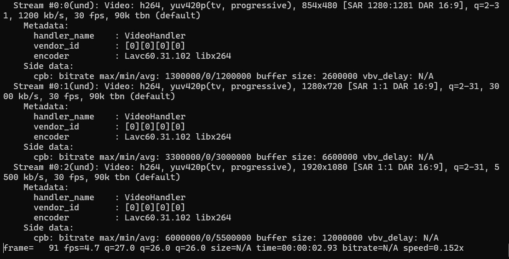

# Transcodierung der Videodatei auf einer virtuellen Maschine

Nachdem der Bucket sowie die virtuelle Maschine eingerichtet wurden, erfolgt im nächsten Schritt die eigentliche Transcodierung einer Videodatei. In AWS würde dieser Schritt durch einen verwalteten Dienst wie AWS Elemental MediaConvert übernommen werden. Da STACKIT aktuell keinen eigenen spezialisierten Transcoding-Dienst bereitstellt, wird dieser Arbeitsschritt in diesem Versuch  auf einer virtuellen Maschine durchgeführt.

Die virtuelle Maschine übernimmt dabei die Rolle eines dedizierten Rechenknotens. Sie greift auf die im Bucket abgelegte Quelldatei zu, verarbeitet diese lokal und speichert die erzeugten Ergebnisdateien anschließend wieder im Bucket ab. Dieses Vorgehen entspricht einem typischen cloudbasierten Workflow, bei dem Speicher und Rechenleistung  voneinander getrennt sind.


## Aktueller Stand des Versuchs

**Bis zu diesem Punkt wurden alle grundlegenden Voraussetzungen für einen cloudbasierten Transcoding-Workflow geschaffen. Die benötigte Infrastruktur ist vollständig eingerichtet und funktionsfähig.**

Zunächst wurde ein Bucket als zentraler Speicherort für die Medieninhalte angelegt und erfolgreich getestet. Anschließend wurde eine virtuelle Maschine bereitgestellt, die als Rechenknoten für die Medienverarbeitung dient. Durch die Einrichtung von Netzwerk, Security Groups und einer öffentlichen IP-Adresse konnte der externe Zugriff auf die virtuelle Maschine ermöglicht werden.

Der erfolgreiche Verbindungsaufbau per SSH bestätigt, dass die virtuelle Maschine korrekt konfiguriert ist und aus dem Internet erreichbar ist. Damit steht nun eine lauffähige Linux-Arbeitsumgebung zur Verfügung, auf der die eigentliche Transcodierung durchgeführt werden kann.

## Ziel der nächsten Schritte

Im folgenden Abschnitt beginnt der zentrale Verarbeitungsschritt des Video-on-Demand-Workflows. Eine im Bucket verfügbare Videodatei wird auf der virtuellen Maschine mithilfe einer Transcoding-Software verarbeitet.

**Konkret werden in den nächsten Schritten:**
- der Zugriff auf die zu transcodierende MXF-Quelldatei konfiguriert
- Streaming-Dateien bestehend aus Manifestdatein und Transportstrom-Chunks aus der MXF-Quelldatei erzeugt
- und die transcodierten Ergebnisse wieder im Bucket abgelegt.

Damit wird der Übergang von der reinen Infrastruktur- und Speicherbereitstellung zur eigentlichen Medienverarbeitung vollzogen, wie er auch in realen cloudbasierten Video-on-Demand-Systemen üblich ist.


### Erzeugen einer signierten URL zum Zugriff auf die Quelldatei

Die Daten in einem Bucket sind standardmäßig gegen den Zugriff aus dem Internet geschützt.
Um die Quelldatei nun mit ffmpeg verarbeiten zu können, wird eine temporär gültige signierte URL (Pre-signed URL) erzeugt.

Pre-signed URLs sind eine Möglichkeit, zeitbegrenzt Zugriff auf eine Datei in eimem S3-Bucket einzuräumen, ohne dazu den Access Key und den Secret Key preiszugeben.

Dazu geben Sie folgenden Befehl ein, das Argument "+3600" is der Gültigkeitszeitraum in Sekunden, hier also 60 Minuten:

```bash
s3cmd signurl s3://<DEINBUCKETNAME>/Versuch1/STEM2-Clip-MVS-STACKIT.mxf +3600
```

!!! info
    Kopieren Sie sich die erzeugte URL!

    Wichtig: Ersetzen Sie bei der späteren Verwendung der URL `http` durch `https`.


## Der Transcodiervorgang
Nun kann die eigentliche Transcodierung durchgeführt werden. Ziel ist es, aus der hochauflösenden Quelldatei mehrere Distributionsformate mit unterschiedlichen Auflösungen und Bitraten zu erzeugen. Diese Formate sind für verschiedene Endgeräte und Netzwerkbedingungen optimiert.

Für die Transcodierung wird das Kommandozeilenwerkzeug **FFmpeg** verwendet. FFmpeg liest die Quelldatei ein, dekodiert sie und erzeugt neue Ausgabedateien mit den vorgegebenen Parametern.


## Transcodierung für adaptives Streaming (HLS)

Neben der Erzeugung klassischer MP4-Distributionsdateien werden in modernen
Video-on-Demand-Systemen häufig adaptive Streaming-Formate eingesetzt.
Diese bestehen aus mehreren kurzen Videosegmenten sowie sogenannten
Manifestdateien, die Informationen über verfügbare Auflösungen, Bitraten
und Segmentabfolgen enthalten.

Im folgenden Abschnitt wird gezeigt, wie mithilfe von FFmpeg aus der
hochaufgelösten Quelldatei ein HLS-kompatibles Streaming-Format inklusive
Manifestdatei erzeugt werden kann. Diese Ausgabeform eignet sich für die
Auslieferung über ein Content Delivery Network (CDN).

### Vorbereitung des Arbeitsverzeichnisses

Zunächst wird auf der virtuellen Maschine ein separates Ausgabeverzeichnis
für die HLS-Dateien angelegt:

```bash
mkdir hls_output
```

**Erstellung der Manifest- und Segmentdateien**

Die Transcodierung erfolgt erneut mithilfe von FFmpeg. Im Gegensatz zur
klassischen MP4-Ausgabe wird hierbei das HLS-Ausgabeformat verwendet.
FFmpeg erzeugt dabei automatisch eine Manifestdatei sowie mehrere
Videosegmente.
`
**Geben Sie folgenden Befehl in das von ihnen gerade erstellte Konsolenverzeichnis ein:**

!!! info
    Wichtig: Die URL muss in Anführungszeichen angegeben werden! Ersetzen Sie auch `http` durch `https`.


```bash
ffmpeg -i "<Secure URL aus dem vorherigen Schritt>" \
  -map 0:v:0 \
  -map 0:v:0 \
  -map 0:v:0 \
  -map 0:a:0 \
  -map 0:a:0 \
  -map 0:a:0 \
  -c:v libx264 -profile:v high422 -crf 20 \
  -filter:v:0 scale=854:480  -b:v:0 1200k -maxrate:v:0 1300k -bufsize:v:0 2600k \
  -filter:v:1 scale=1280:720 -b:v:1 3000k -maxrate:v:1 3300k -bufsize:v:1 6600k \
  -filter:v:2 scale=1920:1080 -b:v:2 5500k -maxrate:v:2 6000k -bufsize:v:2 12000k \
  -c:a aac -b:a 128k -ac 2 -ar 48000 \
  -var_stream_map "v:0,a:0,name:480p v:1,a:1,name:720p v:2,a:2,name:1080p" \
  -f hls \
  -hls_time 4 \
  -hls_playlist_type vod \
  -hls_flags independent_segments \
  -master_pl_name master.m3u8 \
  hls_output/stream_%v.m3u8
```

**Was genau bewirkt der Befehl?**
Der ausgeführte FFmpeg-Befehl erzeugt aus der Eingabedatei  mehrere Versionen desselben Videos mit unterschiedlichen Qualitätsstufen. Diese Gesamtheit der Varianten wird als HLS Bitrate-Ladder bezeichnet.

Im vorliegenden Befehl werden der Video- und Audiostream der Quelldatei dreimal verwendet (`-map 0:v:0` bzw. `-map 0:a:0`). Jede dieser Kopien wird anschließend separat verarbeitet: Eine Variante wird auf **480p** skaliert, eine auf **720p** und eine auf **1080p.** Gleichzeitig werden für jede Auflösung passende Zielbitraten definiert, sodass jede Version eine eigene, klar abgegrenzte Qualitätsstufe darstellt.

Mithilfe der Option **-var_stream_map** werden diese Varianten logisch zusammengefasst. FFmpeg erzeugt daraus ein Master-Manifest **(master.m3u8)** sowie jeweils eigene Manifeste und Segmentdateien pro Qualitätsstufe.

Ein HLS-Player kann anhand dieser Struktur während der Wiedergabe zwischen den erzeugten Varianten wechseln und so die Videoqualität an die aktuelle Netzwerkverbindung anpassen. Der Transcoding-Schritt bildet damit die technische Grundlage für adaptives Streaming im Video-on-Demand-Workflow.

Die folgenden Optionen definieren für jede erzeugte Rendition sowohl die Zielauflösung als auch das Bitratenverhalten des Videos:

```bash
-filter:v:0 scale=854:480  -b:v:0 1200k -maxrate:v:0 1300k -bufsize:v:0 2600k
-filter:v:1 scale=1280:720 -b:v:1 3000k -maxrate:v:1 3300k -bufsize:v:1 6600k
-filter:v:2 scale=1920:1080 -b:v:2 5500k -maxrate:v:2 6000k -bufsize:v:2 12000k
```

Für jede Qualitätsstufe wird das Video zunächst mit scale auf eine feste Zielauflösung umgerechnet. Dadurch entstehen drei klar voneinander getrennte Versionen des Inhalts, die für unterschiedliche Endgeräte und Bildschirmgrößen geeignet sind.

Die Option -b:v legt die angestrebte durchschnittliche Videobitrate der jeweiligen Rendition fest. Niedrigere Auflösungen erhalten bewusst geringere Bitraten, während höhere Auflösungen entsprechend mehr Bandbreite nutzen dürfen. Dadurch bleibt das Verhältnis zwischen Bildqualität und Datenrate ausgewogen.

Mit -maxrate wird eine Obergrenze für kurzfristige Bitratenspitzen definiert. Diese Begrenzung ist insbesondere für Streaming relevant, da starke Bitratenschwankungen zu Pufferproblemen beim Client führen können.

Der Parameter -bufsize beschreibt die Größe des Rate-Control-Puffers und bestimmt, über welchen Zeitraum Bitratenschwankungen ausgeglichen werden dürfen. In Kombination mit -b:v und -maxrate sorgt dieser Mechanismus für ein gleichmäßiges und vorhersagbares Bitratenverhalten der HLS-Segmente.

**Die Ausgabe sollte vergleichbar zu diesem Beispiel sein:**



**Danach kann geprüft werden ob die Manifest- und Segmentdateien angelegt worden sind:**

```bash
ls -lh hls_output
```


Anzeigen der Manifestdatei

Die Manifestdatei ist eine reine Textdatei und kann mit einfachen
Kommandozeilenwerkzeugen betrachtet werden.
Dazu wird der Inhalt der Datei master.m3u8 mit dem Befehl cat ausgegeben:


```bash
cat hls_output/master.m3u8
```


**Die Ausgabe sieht so aus:**


!!! question "Frage 1.5"
    Analysieren Sie die Ausgabe der Datei <code>master.m3u8</code>, die mit dem
    Befehl <code>cat</code> angezeigt wurde.

    Erläutern Sie, welche Informationen in der Manifestdatei enthalten sind und
    welche Bedeutung die einzelnen Einträge (z. B. <code>#EXT</code>-Tags und
    Segmentreferenzen) für die Wiedergabe des Videos haben.

    Gehen Sie dabei insbesondere darauf ein, wie das Manifest den Aufbau des
    Videostreams beschreibt und warum die eigentlichen Mediendaten nicht direkt
    in der Manifestdatei enthalten sind.


## Einspeisung der Manifest- und Segmentdateien in den STACKIT Bucket

Nach der Untersuchung der Manifestdatei werden die erzeugten HLS-Dateien wieder
in das Bucket übertragen.
Dazu wird das gesamte Verzeichnis hls_output in einen Unterordner des zuvor
erstellten Buckets kopiert.

Upload der HLS-Dateien

```bash
s3cmd sync hls_output s3://<DEINBUCKETNAME>/export/ 
```

Dabei werden sowohl die Manifestdatei (master.m3u8) als auch alle zugehörigen
Segmentdateien (.ts) übertragen.

# Überprüfung des Uploads

Um zu prüfen, ob die Dateien erfolgreich im Bucket abgelegt wurden,
wird der Inhalt des Zielverzeichnisses aufgelistet:

```bash
s3cmd ls s3://<DEINBUCKETNAME>/export/hls_upload/
```

In der Ausgabe sollten nun sowohl die Manifestdatei als auch mehrere
Segmentdateien angezeigt werden.


## Analyse der transcodierten Dateien mit MediaInfo

Im nächsten Schritt werden die transcodierten Dateien mit dem Analysewerkzeug *MediaInfo* untersucht.


### Vorbereitung

Zunächst wird mediainfo auf der VM installiert:
```bash
sudo apt-get install mediainfo -y
```


### Analyse über die grafische Oberfläche

Die erzeugten Segmente können über die Kommandozeile analysiert werden, Beispiel:

```bash
mediainfo hls_output/stream_1080p4.ts
```

Dokumentieren Sie für alle Qualitätsstufen (also 480p, 720p, 1080p) die folgende Parameter:
- Auflösung
- Codec
- Framerate
- Containerformat

Dokumentierten Sie für alle Segmente die folgende Parameter:
- Dauer (Duration)
- Bitrate


!!! question "Frage 1.6"
    Vergleichen Sie die von mediainfo angezeigte Bitrate mit den Transcodier-Einstellungen.

    Wie erklären Sie den Unterschied?

    Addieren Sie die Einzel-Dauern der Segmente. Stimmt die Summe mit der Dauer der Quelldatei überein?


**Darunter sollten Sie jetzt Werte angezeigt bekommen wie bspw: Format, Formatprofil,...**
**Fertigen Sie bitte einen Screenshot der verschiedenen transcodierten Versionen an und betten Sie diese in ihre Abgabemappe ein**


!!! question "Frage 1.7"
    **Nun ist ihre Kreativität gefragt...**
    Transcodieren Sie die Quelldatei erneut mit <em>FFmpeg</em> und nehmen Sie dabei eigenständig Anpassungen an den Transcodierungsparametern vor.<br><br>

    Verändern Sie mindestens zwei der folgenden Punkte:
    <ul>
      <li>Video-Codec</li>
      <li>Video-Bitrate</li>
      <li>Audio-Bitrate</li>
    </ul>


    Der benötigte FFmpeg-Befehl kann durch Abwandlung des obigen ffmpeg-Befehls erstellt werden.
    Wichtig: Wählen Sie einen anderen Ausgabe-Ordner, z.B. `hls_output_2

    Kopieren Sie den erstellten Unterordner wiederum in den export/ Ordner Ihres Bucket. 

    Analysieren Sie die erzeugte Ausgabedatei anschließend mit <em>MediaInfo</em> und dokumentieren Sie:
    <ul>
      <li>die gewählten Parameter</li>
      <li>den verwendeten FFmpeg-Befehl</li>
      <li>die Unterschiede zur vorherigen Transcodierung</li>
    </ul>


