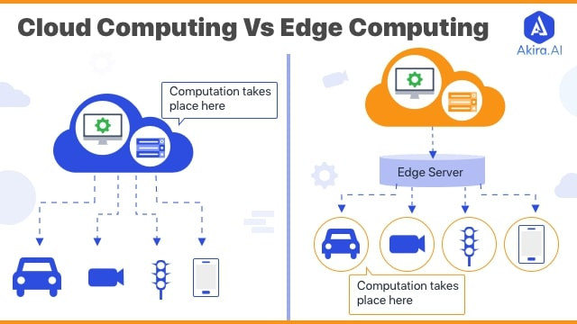

# Einführung

In **Versuch 2** steht die Verteilung der transcodierten Mediendateien über ein Content Delivery Network (CDN) im Vordergrund.  
Während in Versuch 1 die Verarbeitung und Transcodierung der Videodateien betrachtet wurde, geht es nun darum, wie diese Inhalte performant und zuverlässig an Endnutzer ausgeliefert werden können.

Die tiefergehende theoretische Betrachtung von CDNs wird an dieser Stelle nicht weiter vertieft. Stattdessen liegt der Fokus auf dem praktischen Verständnis der beteiligten Komponenten und deren Zusammenspiel innerhalb eines typischen Video-on-Demand-Workflows.

Als CDN-Anbieter wird in diesem Versuch **Fastly** verwendet. Der zugrunde liegende Objektspeicher bleibt weiterhin der **STACKIT Object Storage**, der als Ursprung der Mediendateien dient.

---
## Grundbegriffe

### Content Delivery Network (CDN)

Ein Content Delivery Network besteht aus einer Vielzahl weltweit verteilter Server, sogenannten Edge-Servern.  
Diese Server stellen Inhalte geografisch nah am Endnutzer bereit, um Ladezeiten zu reduzieren und eine hohe Verfügbarkeit zu gewährleisten.

Statt dass jede Anfrage direkt an den ursprünglichen Speicherort gesendet wird, übernimmt das CDN die Verteilung der Inhalte.

---
### Fastly

Fastly ist ein moderner CDN-Anbieter, der besonders auf geringe Latenzen und hohe Performance ausgelegt ist.  
Das CDN arbeitet mit einem sogenannten Edge-Ansatz, bei dem Inhalte möglichst nah am Endnutzer ausgeliefert werden.

Fastly kann über eine Weboberfläche oder über APIs konfiguriert werden. In diesem Versuch wird hauptsächlich die Weboberfläche genutzt, um die grundlegenden Konzepte eines CDNs zu verstehen.

---
 Auch bei der Nutzung eines CDNs entstehen Kosten, die sich vor allem aus der übertragenen Datenmenge ergeben.  
    Je mehr Daten an Endnutzer ausgeliefert werden, desto höher sind die anfallenden Kosten.  
    Für diesen Versuch wird ein begrenztes Nutzungskontingent verwendet.

---
### Origin

Als *Origin* wird der ursprüngliche Speicherort der Mediendateien bezeichnet.  
In diesem Versuch dient der **STACKIT Object Storage** als Origin.
  
Fastly greift nur dann auf den Origin zu, wenn eine angeforderte Datei noch nicht im CDN zwischengespeichert ist oder der Cache erneuert werden muss.

---
### Caching

Fastly speichert abgerufene Inhalte temporär auf seinen weltweit verteilten Edge-Servern.  
Dieses sogenannte *Caching* sorgt dafür, dass häufig abgerufene Mediendateien nicht bei jeder Anfrage erneut vom Origin geladen werden müssen.

Gerade bei Video-on-Demand-Inhalten ist Caching ein zentraler Mechanismus zur Reduktion von Latenzen und Serverlast.
---
---

### Service

Die Konfiguration eines CDNs wird bei Fastly in sogenannten *Services* abgebildet.  
Ein Service definiert unter anderem:
- den verwendeten Origin
- die zugehörigen Hostnamen
- das Caching-Verhalten

Ein Service bildet somit die zentrale Konfigurationseinheit für die Auslieferung der Inhalte.

---

### Hostname

Über einen Hostnamen werden die Mediendateien über das CDN erreichbar gemacht.  
In diesem Versuch wird ein von Fastly bereitgestellter Hostname genutzt, da keine eigene Domain konfiguriert wird.

Endnutzer oder Mediaplayer greifen später über diesen Hostnamen auf die transcodierten Dateien zu.

---

### Edge-Server

Edge-Server sind die weltweit verteilten Server von Fastly.  
Sie nehmen Anfragen entgegen und liefern die Inhalte möglichst nah am Standort des Nutzers aus.

Durch den Einsatz von Edge-Servern werden Ladezeiten reduziert und die Auslieferung skalierbar gestaltet.

---

## Cloud Computing im Video-on-Demand-Kontext

Das oben dargestellte Schaubild zeigt den grundlegenden Unterschied zwischen *Cloud Computing* und *Edge Computing*.  
Beide Konzepte spielen auch bei der Auslieferung von Video-on-Demand-Inhalten eine wichtige Rolle.

---

### Cloud Computing

Beim Cloud Computing findet die Verarbeitung zentral in einer Cloud-Infrastruktur statt.  
In einem Video-on-Demand-System betrifft dies vor allem Aufgaben wie:

- Speicherung der Quelldateien  
- Transcodierung der Videos in verschiedene Auflösungen  
- Verwaltung der Medieninhalte  

In diesem Versuch übernimmt der **STACKIT Object Storage** die Rolle der Cloud-Komponente.  
Die Videodateien liegen zentral in der Cloud vor und dienen als Ursprung (Origin) für weitere Verarbeitungsschritte.

Würde ein Endnutzer direkt auf diesen Cloud-Speicher zugreifen, müsste jede Anfrage bis zum zentralen Rechenzentrum weitergeleitet werden.  
Dies kann zu höheren Ladezeiten und einer stärkeren Belastung des Speichers führen.

### Bedeutung für diesen Versuch

In diesem Versuch wird das Zusammenspiel beider Konzepte deutlich:

- **Cloud Computing:**  
  STACKIT Object Storage dient als zentraler Speicherort für die transcodierten Mediendateien.

Dieses Zusammenspiel ist typisch für moderne Video-on-Demand-Systeme.  
Die Cloud stellt die Inhalte bereit, während das CDN mit Edge Computing für eine schnelle, skalierbare und zuverlässige Auslieferung an Endnutzer sorgt.

