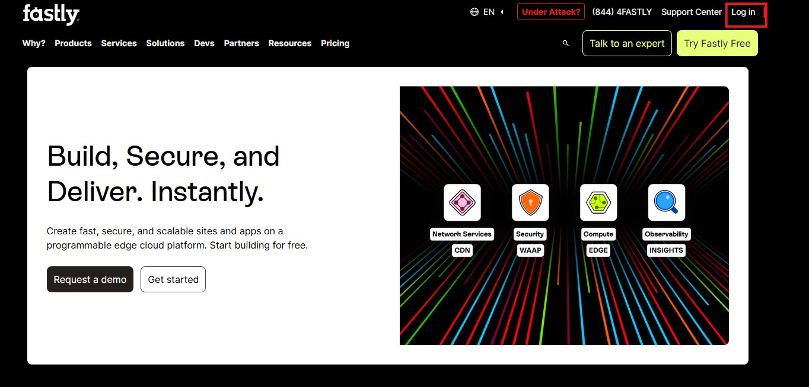
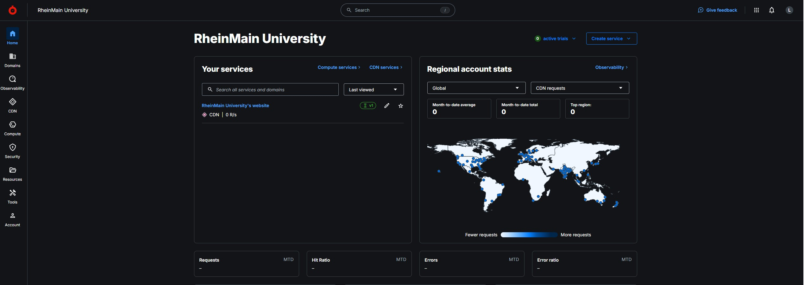
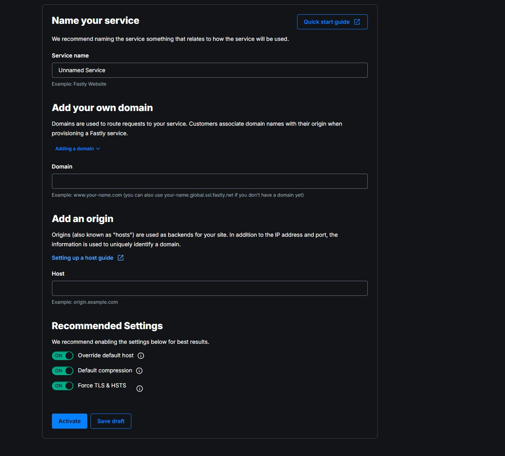
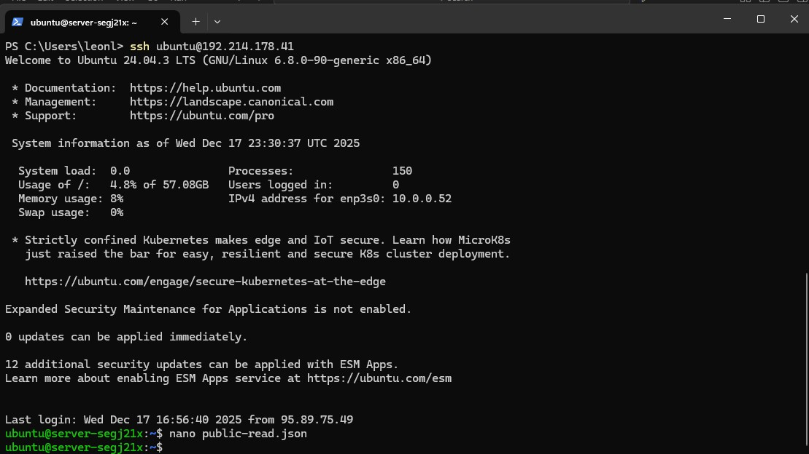
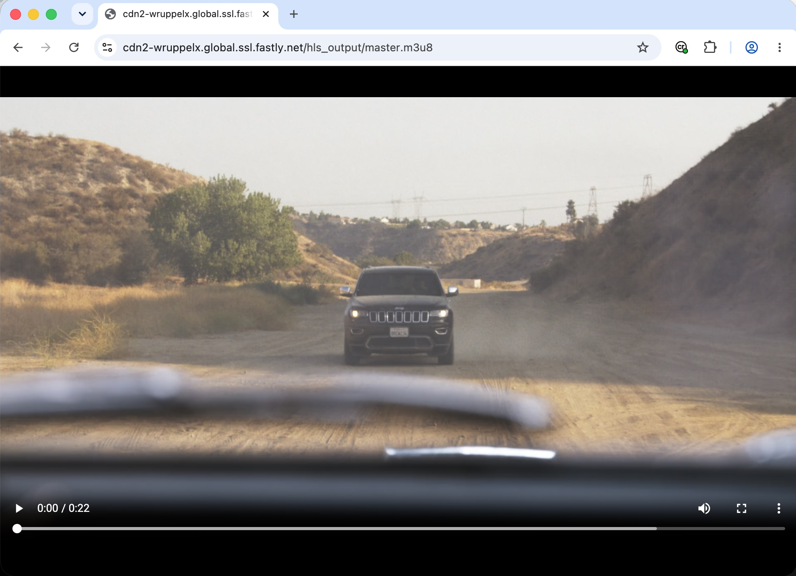

# Service-Konfiguration in Fastly

In diesem Versuch wird auf den transcodierten Videodateien aus Versuch 1 aufgebaut.  
Ziel ist es, diese Dateien über ein Content Delivery Network (CDN) bereitzustellen.
Der Abruf über CDN soll in einem weiteren Schritt mit dem direkten Abruf aus dem S3-Bucket verglichen werden.

Als CDN-Anbieter wird **Fastly** verwendet.

---
**Doch was genau bringt uns das eigentlich und wofür machen wir das ganze hier. Mit einer Grafik wird versucht zu erklären was die klaren Vorteile hierbei sind**


**Verstanden? Dann kann es nun losgehen! Wir gehen das wieder Schritt für Schritt durch!**

## Schritt 1: Ausgangslage

Die transcodierten Videodateien liegen im STACKIT Bucket im Unterordner `export/`.


Der Bucket übernimmt die Rolle des **Origin Servers**.

**Soweit ist alles vorbereitet für die Kopplung an das CDN. im nächsten Schritt wird die Bedienung für Fastly erklärt**


Navigieren Sie bitte zur Internetseite von Fastly [https://www.fastly.com/](https://www.fastly.com/){:target="_blank"} und melden Sie sich dort mit ihren Credentials an:



*leave blank for further instructions*

**Sie sollten nun die folgende Fastly Startseite vor sich sehen.**



## Schritt 1: Neuen Fastly Service erstellen

Nach dem Login befindet man sich im Fastly-Dashboard des Kurses.  
Da für diesen Versuch noch kein CDN-Service existiert, muss zunächst ein neuer Service angelegt werden.


### 1. Service-Erstellung starten

Im oberen rechten Bereich des Dashboards wird der Button **Create service** ausgewählt.


**Wählen Sie dort bitte CDN**

**Folgende Maske sollte nun erscheinen:**



**Tätigen Sie dort bitte folgende Einstellungen:**

| Feld         | Eingabe                               |
|----------------------|----------------------------------------|
| Service name         | `cdn2-[HDS-Nutzername]`           |
| Eigene Domain        | `cdn2-[HDS-Nutzername].global.ssl.fastly.net` |
| Origin Host          | `bucket-[HDS-Nutzername].object.storage.eu01.onstackit.cloud`|
| Override default host| aktiviert                              |
| Default compression  | aktiviert                              |
| Force TLS & HSTS  | aktiviert                                 |

Klicken Sie auf **Activate**.

Anschließend klicken Sie  **Clone to edit** und fahren Sie in der Anleitung fort.

**So sollte es nun bei Ihnene aussehen:**


**Es wurde nun ein eigener DNS-Eintrag für Sie angelegt:
 cdn2-[HDS-Nutzername].global.ssl.fastly.net**


### 2. VCL Anpassungen

Bei der Auslieferung großer Videodateien aus dem STACKIT Bucket über Fastly stößt die Standardkonfiguration schnell an Grenzen. Für neue Fastly-Accounts dürfen Objekte ohne Zusatzfunktionen nur bis zu einer Größe von 20 MB im Cache gespeichert werden. Das verwendete Testvideo (testvideo.mp4) ist deutlich größer, weshalb ein normaler Cache-Zugriff zu einer Fehlermeldung („Response object too large“) führt.

Um solche Dateien trotzdem performant über das CDN ausliefern zu können, bietet Fastly Segmented Caching an. Dabei wird das Video nicht als einzelne große Datei im Cache abgelegt, sondern in kleinere Abschnitte zerlegt. Diese Segmente lassen sich unabhängig voneinander zwischenspeichern und bei Bedarf wieder zusammensetzen. Das passt gut zu typischen Videoabrufen, da moderne Mediaplayer Inhalte ohnehin in Form von Byte-Range-Anfragen anfordern.

Segmented Caching ist standardmäßig nicht aktiv und muss gezielt konfiguriert werden.

Navigieren Sie unter **LOGGING** zu dem Reiter Snippets


Übergeben Sie auf der Einrichtungsmaske folgende Parameter:

**Name:** enable-segmented-caching

**Placement:** Within subroutine

**Subroutine:** recv(vcl_recv)

**Priority:** 100

```bash
# Modify request URL
set req.url = "/export" + req.url;
# Enable Segmented Caching
if ((req.url.ext == "ts") || (req.url.ext == "mp4")) {
  set req.enable_segmented_caching = true;
}
```


### 3. Cross-origin resource sharing in den Einstellungen aktivieren

Cross-origin resource sharing (CORS) ist für die Stream-Analyse mit einem HLS-Player erforderlic.

Aktivieren Sie CORS in den Einstellungen Ihres Service wie im folgenden beschrieben:

[Enabling CORS](https://www.fastly.com/documentation/guides/full-site-delivery/headers/enabling-cross-origin-resource-sharing/){:target="_blank"}

Übernehmen Sie dabei alle Einstellungen wie unter "5. Create header" beschrieben.

### 4. Aktivierung

Überprüfen Sie, ob das VCL-Snippets angelegt wurde.

Aktivieren Sie dann Ihren CDN Service durch Klicken auf **Activate**.

Nach der Aktivierung ist der Service aktiv und die Inhalte können über die
zugewiesene Domain abgerufen werden.

## Erster Test des Fastly CDN

**Gehen Sie nun in den Browser und geben Sie dort folgendes ein:**

```bash
https://cdn2-[HDS-Nutzername].global.ssl.fastly.net/hls_ouput/master.m3u8
```

!!! question "Frage 2.1"
    Welche Fehlermeldung bekommen Sie? Fertigen Sie hierfür bitte einen Screenshot an und tragen Sie diesen in ihre Abgabemappe ein.

    Interpretieren Sie die angegebene Nachricht 

Das Problem lässt sich lösen indem wir nun Zugriffsrechte auf das Origin-Bucket konfigurieren.

## Zugriffsrechte auf Origin-Server erstellen

**STACKIT erlaubt es, anders als AWS, nicht, die Zugriffsrechte auf dem Web-Portal anzupassen. Hierfür müssen wir der VM die Rechte händisch mitgeben. Das klingt komplizierter, als es eigentlich ist. In ein paar Schritten ist dies getan**


**Verbinden sie sich mit der VM von STACKIT**

```bash
ssh ubuntu@<IP-DEINER-VM>
```
**Sie müssten sich hier wieder finden.**


**Nun wird die Datei angelegt die uns die Berechtigung geben soll. Geben Sie hierfür folgendes ein.**

```bash
nano public-read.json
```
**Die Maske der Powershell sollte nun so aussehen:**


**Geben Sie nun folgenden Code in nano ein:**

```bash
{
  "Version": "2012-10-17",
  "Statement": [
    {
      "Effect": "Allow",
      "Principal": "*",
      "Action": "s3:GetObject",
      "Resource": "arn:aws:s3:::<DeinBucketname>/*"
    }
  ]
}
```

**Speichern Sie dei datei mit CTRL+o (Buchstabe o, nicht null!)).**

**Danach ENTER**

**Danach CTRL+X für das Schließen**

**Sie befinden sich wieder auf der Hauptmaske**



---
**Nun wird die Policy Ihrem Bucket zugeordnet**


```bash
s3cmd setpolicy public-read.json s3://<DeinBucketname>
```


***Navigieren Sie bitte jetzt zu dem Internetbrowser firefox und geben sie erneut die URL ein:**

```bash
https://cdn2-[HDS-Nutzername].global.ssl.fastly.net/hls_output/master.m3u8
```

Je nach Browser wird entwede die m3u8-Datei heruntergeladen, oder das Abspielen des Streams gestartet.

**Falls Ihr Browser den Stream abspielt, sollten Sie folgende Ausgabe erhalten:**



Jetzt interessiert uns noch, von wo diese Ablieferung stattfindet. 

!!! question "Frage 2.2"
    Mit welchem Kommandozeilenbefehl können Sie überprüfen, auf welche IP-Adressen der CDN-Hostname aufgelöst wird und welcher Edge-Server für die Auslieferung der Inhalte verwendet wird? 
    
    Fertigen Sie hierzu einen Screenshot der Ausgabe an.


!!! info
    Bei DNS-Abfragen kann es sinnvoll sein, einen öffentlichen DNS-Resolver wie
    <code>1.1.1.1</code> (Cloudflare) anzugeben, da lokale Router oder
    Provider-DNS bei CDN-Hostnamen zu Timeouts oder unerwarteten Ergebnissen
    führen können.


