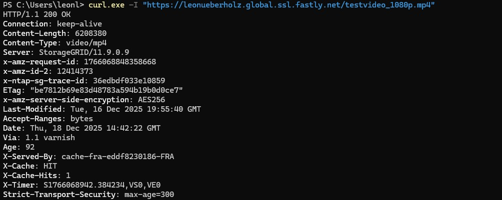
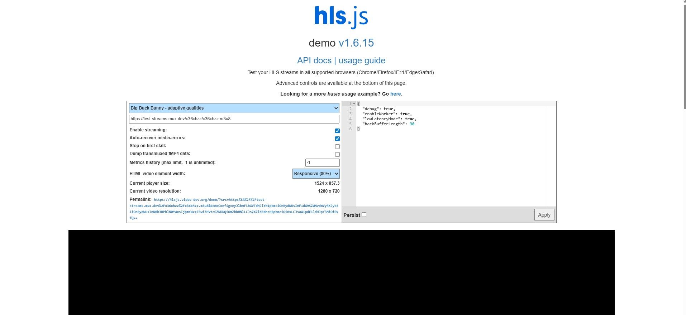
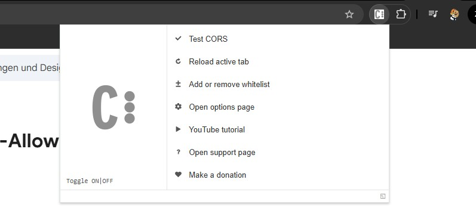
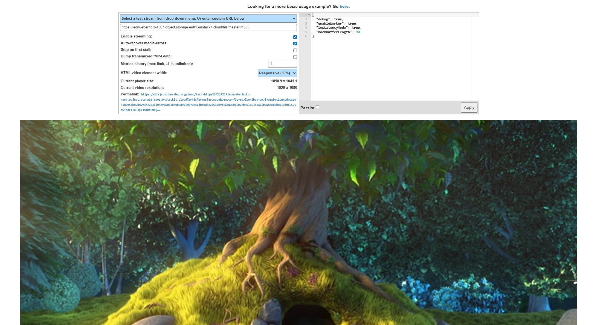

# Caching bei Content Delivery Networks
Ein zentrales Funktionsprinzip von Content Delivery Networks (CDNs) ist das sogenannte Caching.
Dabei werden Inhalte, die einmal vom Ursprungssystem (Origin) abgerufen wurden, zwischengespeichert und bei späteren Anfragen erneut ausgeliefert, ohne den Origin erneut zu kontaktieren.

Im Kontext dieses Versuchs bedeutet das:
Die Videodateien liegen dauerhaft im STACKIT Object Storage, werden jedoch über Fastly an die Endnutzer ausgeliefert.
Fastly übernimmt dabei nicht nur die Weiterleitung der Anfrage, sondern speichert häufig angefragte Inhalte direkt auf seinen Edge-Servern.

Durch dieses Vorgehen ergeben sich mehrere Vorteile:

kürzere Ladezeiten für Endnutzer

geringere Last auf dem Object Storage

bessere Skalierbarkeit bei vielen gleichzeitigen Zugriffen

**Caching ist somit eine der wichtigsten Komponenten moderner Video-on-Demand- und Streaming-Systeme und spielt eine zentrale Rolle in der praktischen Medientechnik.**

Im nächsten Schritt soll nun praktisch überprüft werden, wie sich dieses Caching-Verhalten äußert und wie erkennbar ist, ob eine Datei direkt vom Origin oder aus dem Cache des CDNs ausgeliefert wird.


## Schritt 1: Erster Abruf 

1. Öffnen Sie eine Kommandozeile
2. Führen Sie folgenden Befehl aus:

```bash
curl.exe -I "https://<namenachname>.global.ssl.fastly.net/testvideo_1080p.mp4"
```
**Navigieren Sie zu der Line "X-Cache". Was sehen Sie dort? Machen Sie einen Screenshot**


## Schritt 2: Zweiter abruf

1. Führen Sie bitte den gleichen Befehl ein erneutes mal aus:

```bash
curl.exe -I "https://<username>.global.ssl.fastly.net/testvideo_1080p.mp4"
```
**Die Ausgabe sollte nun wie folgt aussehen:**



<div style="
  border: 2px solid #ffffff;
  padding: 14px;
  border-radius: 6px;
  margin: 14px 0;
">
  <span style="color:cyan; font-weight:bold; font-size:1.2em;">
    Aufgabe 10:
  </span><br>
  <ul>
    <li>Woran lässt sich erkennen, dass die Datei beim zweiten Abruf aus dem Cache ausgeliefert wurde?</li>
    <li>Welche Bedeutung haben die Header <code>X-Cache</code> und <code>Age</code>?</li>
    <li>Warum sind in der Antwort weiterhin Header des Origin-Servers sichtbar?</li>
  </ul>
</div>

# Wiedergabe des HLS-Streams (STACKIT + Fastly)

Nun soll auch praktisch geschaut werden ob das Video abspielbar im Browser zu sehen ist. Hierfür gilt die nun folgende Anleitung:

---
## HLS-Test mit hls.js Demo Player

Zur Überprüfung der adaptiven HLS-Wiedergabe wird die offizielle Demo-Instanz von hls.js verwendet.

Der Player ist erreichbar unter:

https://hlsjs.video-dev.org/demo/



---
## ⚠️ Wichtiger Hinweis zu CORS (zwingend erforderlich)

Der Demo-Player wird von einer anderen Domain geladen als der HLS-Stream (Fastly).  
Aufgrund der Same-Origin-Policy blockiert der Browser standardmäßig die Segment-Dateien.

Typische Fehlermeldungen:

- manifestLoadError
- levelLoadError
- Segmente werden nicht geladen


### Lösung: CORS-Browser-Extension

Für diesen Versuch ist die Verwendung einer CORS-Extension erforderlich.

Beispiel (Chrome):

https://chromewebstore.google.com/detail/allow-cors-access-control/lhobafahddgcelffkeicbaginigeejlf

### Aktivierung von CORS

1. Extension installieren  
2. In Chrome auf das Puzzle-Symbol klicken  
3. CORS-Extension auswählen  
4. „Toggle ON“ aktivieren  



---

Nach Aktivierung der Extension:

1. Zur hls.js Demo-Seite zurückkehren  
2. Beispiel-URL im Player ersetzen  

### URL-Struktur


**https://<DeinBucketname>.object.storage.eu01.onstackit.cloud/hls/master.m3u8**



---


# Was wurde praktisch erreicht?

Transcodierte Videodateien wurden erfolgreich über ein CDN ausgeliefert

Der Object Storage fungierte als reiner Origin, nicht als direkter Auslieferungspunkt

Ein öffentlicher CDN-Hostname ermöglichte den Zugriff ohne direkten Speicherzugang

Die Auslieferung konnte sowohl im Browser als auch über Kommandozeilenwerkzeuge getestet werden

Besonders wichtig war die Erkenntnis, dass ein funktionierender Abruf nicht nur von der Datei selbst, sondern von korrekten Zugriffsrechten, DNS-Auflösung und CDN-Konfiguration abhängt.


