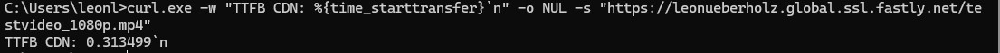

# Experiment: Time-to-First-Byte (TTFB) – Origin vs. CDN

**Experiment: Time-to-First-Byte (TTFB) – Origin vs. CDN**

In diesem Experiment soll untersucht werden, welchen Einfluss ein Content Delivery Network (CDN) auf die Antwortzeit beim Abruf einer Videodatei hat.

**Konkret wird die Time-to-First-Byte (TTFB) verglichen:**
- einmal beim direkten Abruf der Datei aus dem STACKIT Object Storage (Origin)
- einmal beim Abruf derselben Datei über das Fastly CDN

Die TTFB beschreibt die Zeit, die vergeht, bis das erste Datenbyte beim Client ankommt, nachdem die Anfrage abgeschickt wurde.
Sie ist ein wichtiger Indikator für die wahrgenommene Ladegeschwindigkeit von Medieninhalten.

## Schritt-für-Schritt-Anleitung

### Schritt 1: Voraussetzungen prüfen

- **Die Videodatei testvideo_1080p.mp4 liegt im STACKIT Object Storage**

- **Die Datei ist öffentlich über Fastly erreichbar, z. B.:**

```bash
https://<username>.global.ssl.fastly.net/testvideo_1080p.mp4
```
### Schritt 2: TTFB direkt vom Origin messen

Öffnen Sie ein Terminal (Linux/macOS) oder die PowerShell unter Windows
und führen Sie folgenden Befehl aus:

```bash
curl -w "TTFB Origin: %{time_starttransfer}\n" -o /dev/null -s https://object.storage.eu01.onstackit.cloud/<DEIN BUCKETNAME>/testvideo_1080p.mp4
```

**Dieser misst die Zeit des Origin downloads:**

**Notieren Sie sich bitte diese Zeit!**

**Nun öffnen Sie bitte eine weitere CMD und geben dort folgendes ein:**

```bash
curl.exe -w "TTFB CDN: %{time_starttransfer}`n" -o NUL -s `
https://leonueberholz.global.ssl.fastly.net/testvideo_1080p.mp4
```

!!! question "Frage 2.4"
  <ul>
    <li>Messen Sie die Time-to-First-Byte (TTFB) für jede transcodierte Version
        (<code>1080p</code>, <code>720p</code>, <code>480p</code>) über das CDN.</li>
    <li>Führen Sie jede Messung mindestens drei Mal durch.</li>
    <li>Berechnen Sie für jede Auflösung den Median der gemessenen TTFB-Werte.</li>
    <li>Vergleichen Sie die Mediane der verschiedenen Auflösungen.</li>
  </ul>

**Das sollte dann so aussehen:**



