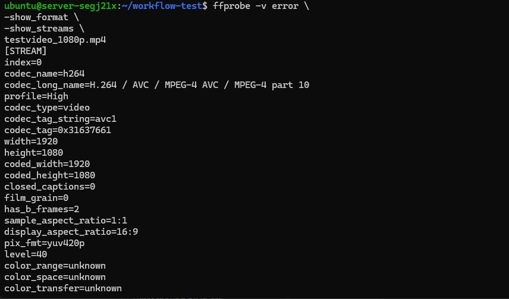

# Mini-Test: Ingest → Analyse → CDN-Abruf

## Kurzinfo

In dieser Teilaufgabe sollen die transcodierten Dateien und die CDN-Auslieferung weiter analysiert werden

## Voraussetzungen

- Eine transcodierte Videodatei liegt im STACKIT Bucket
(z. B. stream_1080p0.ts)

- Die Datei ist über Fastly erreichbar
(z. B. https://cdn2-[HDS-Nutzername].global.ssl.fastly.net/hls_output/stream_1080p0.ts)

- Zugriff auf eine Linux-VM  mit curl und ffmpeg/ffprobe

## Ablaufplan


Öffnen Sie erneut mit `ssh`die Verbindung zu Ihrer STACKIT-VM und legen Sie ein Verzeichnis an:

```bash
mkdir workflow-test
cd workflow-test
```


### CDN-Antwort abrufen

Ziel dieses Schrittes:

- Prüfen ob die Datei erreichbar ist

- Die CDN-Antwort analysieren


**Führen Sie bitte diesen Befehl aus:**

```bash
curl.exe -I "https://cdn2-[HDS-Nutzername].global.ssl.fastly.net/hls_output/stream_1080p0.ts"
```

**Sie sollten jetzt eine Auflistung sehen:**

**Tragen Sie die die übergeben Prameter in eine Tabelle wie unten dargestellt ein:**

| HTTP-Header / Feld           | Bedeutung / Beobachtung (ausfüllen) |
|-----------------------------|-------------------------------------|
| HTTP/1.1 200 OK             |                                     |
| Connection                  |                                     |
| Content-Length              |                                     |
| Content-Type                |                                     |
| Server                      |                                     |
| x-amz-request-id            |                                     |
| x-amz-id-2                  |                                     |
| x-ntap-sg-trace-id          |                                     |
| ETag                        |                                     |
| x-amz-server-side-encryption|                                     |
| Last-Modified               |                                     |
| Accept-Ranges               |                                     |
| Age                         |                                     |
| Date                        |                                     |
| Via                         |                                     |
| X-Served-By                 |                                     |
| X-Cache                     |                                     |
| X-Cache-Hits                |                                     |
| X-Timer                     |                                     |
| Strict-Transport-Security   |                                     |

### Analyse der Streaming-Dateien 

Zur Analyse der ersten Streaming-Datei geben sie  folgenden Befehl ein:**

```bash
ffprobe -v error \
-show_format \
-show_streams \
"https://cdn2-[HDS-Nutzername].global.ssl.fastly.net/hls_output/stream_1080p0.ts"
```

**Die Ausgabe sieht so aus:**


Kopieren Sie die Ausgabe in ein  Textdokument `stream_1080p0.txt`.

Wiederholen Sie daen Befehl für die folgenden weiteren Dateien :

stream_720p0.ts

stream_480p0.ts

**Kopieren Sie die Ausgaben jeweils in die Textdokumente `stream_720p0.txt` und `stream_480p0.txt`**

!!! question "Frage 3.1: Vergleich der Transcoding-Ergebnisse"
    Analysieren Sie die Ausgaben von <code>ffprobe</code> für die folgenden Dateien:
    <ul>
      <li><code>stream_1080p0.ts</code></li>
      <li><code>stream_720p0.ts</code></li>
      <li><code>stream_480p0.ts</code></li>
    </ul>

    Gehen Sie dabei insbesondere auf folgende Punkte ein:
    <ul>
      <li>Welche technischen Parameter unterscheiden sich zwischen den Dateien?</li>
      <li>Welche Parameter sind bei allen Versionen identisch?</li>
      <li>Wie verändert sich die Bitrate im Verhältnis zur Auflösung?</li>
      <li>Welche Auswirkungen haben diese Unterschiede auf Bandbreite und Speicherbedarf?</li>
    </ul>


