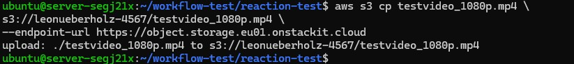
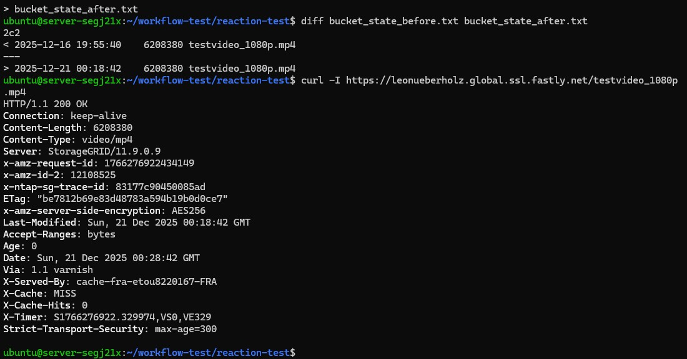

# Automatische Reaktion auf neue Inhalte

In diesem abschließenden Versuch soll gezeigt werden, wie ein einfacher
automatisierter Workflow ohne Cloud Functions umgesetzt werden kann.

Dazu wird regelmäßig geprüft, ob sich Inhalte im Object Storage geändert haben.
Wird eine Änderung erkannt, wird automatisch eine Überprüfung der CDN-Auslieferung durchgeführt.

Dieses Vorgehen ist typisch für einfache produktive Medienworkflows
und wird häufig in Kombination mit Cronjobs oder Monitoring-Skripten eingesetzt.

## Architekturidee
## Beispiel-Workflow

1. Aktuellen Zustand des Object Storage erfassen
2. Änderung im Object Storage erzeugen
3. Object Storage erneut prüfen
4. Änderung erkennen
5. Reaktion ausführen
6. CDN-Auslieferung kontrollieren
7. Ergebnis dokumentieren


### Schritt 1: Arbeitsverzeichnis vorbereiten

**Melden Sie sich auf der VM an und erstellen Sie ein neues Verzeichnis für den Versuch:**


**Auf der VM anmelden:**

```bash
ssh ubuntu@<DeineIPvomServer>
```

**Directory erstellen:**

```bash
mkdir reaction-test
cd reaction-test
```

**Das schaut dann so aus:**

**Laden Sie nun auch hier wieder einer der 3 transcodierten Files aus dem Bucket herunter mit folgendem Command:**

```bash
s3cmd get s3://<DeinBucketname>/testvideo_1080p.mp4 testvideo_1080p.mp4
```


### Schritt 2: Aktuellen Zustand des Object Storage erfassen

**Gebe nun folgenden Befehl ein:**

```bash
s3cmd ls s3://<ihr bucketname> > bucket_state_before.txt
```

<!!! question "Frage 3.3"
    Betrachten Sie folgenden Befehl:

    <pre><code>
      s3cmd ls s3://<ihr bucketname> > bucket_state_before.txt
    </code></pre>

    Beschreiben Sie in eigenen Worten:
    <ul>
      <li>Was der Befehl genau bewirkt</li>
      <li>Warum die Ausgabe in eine Datei umgeleitet wird</li>
    </ul>


### Schritt 3: Datei im Object Storage ändern (Ingest simulieren)

 **Jetzt rufen wir mit folgendme Befehl eine Änderung im Bucket hervor:**

```bash
s3cmd put testvideo_1080p.mp4 s3://<ihr bucketname>/testvideo_1080p.mp4
```

**Das sollte so aussehen:**



### Schritt 4: Neuen Zustand erfassen

**Jetzt speichern wir den Zustand nach der Änderung.**

```bash
s3cmd ls s3://<ihr bucketname> > bucket_state_after.txt
```

**und vergleichen den Vorher Nachher Zustand**
  
```bash
diff bucket_state_before.txt bucket_state_after.txt
```

**Was ist nun zu sehen? Dokumentiere SIe ihre Beobachtung.**

## Schritt 5: Reaktionsauslösung

**Jetzt prüfen wir automatisch, ob die geänderte Datei korrekt über Fastly ausgeliefert wird.**

```bash
curl -I https://<DeineDomain>.global.ssl.fastly.net/testvideo_1080p.mp4
```
**Die Ausgabe zeigt uns an:**



**Ein weiteres mal der gleiche Abruf:**
```bash
curl -I https://<DeineDomain>.global.ssl.fastly.net/testvideo_1080p.mp4
```

## Was ist hier gerade passiert?

Was ist hier gerade passiert? (Einordnung)

In diesem Experiment wurde kein klassischer Event-Trigger, keine Cloud Function und kein serverseitiger Automatisierungsdienst eingesetzt.
Trotzdem hat das Gesamtsystem korrekt auf eine Änderung reagiert.

**1️. Änderung im Object Storage**

Zunächst wurde der Zustand des STACKIT Object Storage verändert:

Eine Datei wurde neu hochgeladen oder

eine bestehende Datei wurde ersetzt

Der Object Storage fungiert dabei als Single Source of Truth:
Er enthält immer die aktuell gültige Version der Mediendateien.

Wichtig:

Der Object Storage informiert niemanden aktiv über diese Änderung.

**2️. Erkennung der Änderung (State Comparison)**

Die Änderung wurde nicht durch ein Ereignis erkannt, sondern durch Zustandsvergleich:

Ein vorher gespeicherter Zustand (z. B. Dateiliste)

wird mit einem aktuellen Zustand verglichen

Unterschiede (neue / geänderte Dateien) werden sichtbar

Dieses Prinzip ist extrem verbreitet:

-Cronjobs

-Monitoring-Systeme

-Medien-QA-Pipelines

-Backup- und Sync-Tools

 **Das System reagiert nicht auf Events, sondern auf Unterschiede.**

**3️. Abruf über das CDN**

Nach der erkannten Änderung wird die Datei erneut über das CDN abgerufen:

Client fragt Fastly nach der Datei

Fastly prüft:

Ist die Datei im Cache vorhanden?

Ist sie gültig?

Da sich der Origin-Inhalt geändert hat, muss Fastly:

die Datei neu vom Origin abrufen

die neue Version an den Client ausliefern

**4️. Automatisches Caching im CDN**

Sobald Fastly die neue Datei vom Object Storage abgerufen hat:

wird sie automatisch auf dem Edge-Server gespeichert

zukünftige Anfragen werden aus dem Cache bedient

Wichtig:

Das Caching ist keine explizite Aktion, sondern eine Folge der Auslieferung.

**5️. Warum das eine „automatische Reaktion“ ist**

Auch ohne Lambda, Webhooks oder Trigger hat das System korrekt reagiert, weil:

der Origin den neuen Zustand bereitstellt

das CDN konsistent auf Anfragen reagiert

der Cache sich selbst aktualisiert, sobald neue Inhalte angefragt werden

!!! question "Frage 3.4: Automatische Reaktion im CDN-Workflow"
    In diesem Versuch wurde bewusst <b>keine</b> Cloud Function,
    <b>kein</b> Event-Trigger und <b>kein</b> serverseitiger Automatisierungsdienst
    (z.&nbsp;B. AWS Lambda) eingesetzt.<br><br>

    Trotzdem konnte beobachtet werden, dass das System korrekt auf eine Änderung
    im <b>STACKIT Object Storage</b> reagiert hat und die neue Datei
    über das <b>Fastly CDN</b> ausgeliefert wurde.

    <b>Beschreiben Sie in eigenen Worten:</b>
    <ul>
      <li>was sich konkret im Object Storage geändert hat,</li>
      <li>wie diese Änderung vom CDN technisch „bemerkt“ wird,</li>
      <li>warum kein explizites Ereignis oder Trigger notwendig war.</li>
    </ul>

    <b>Gehen Sie dabei insbesondere auf folgende Punkte ein:</b>
    <ul>
      <li>die Rolle des HTTP-Requests vom Client,</li>
      <li>die Funktion des Origin-Servers im CDN-Kontext,</li>
      <li>das Zusammenspiel von Cache, Cache-Miss und erneuter Speicherung.</li>
    </ul>


!!! question "Frage 3.5"
    <b>Bewerten Sie, warum dieses einfache Reaktionsmodell in der Praxis für viele Video-on-Demand-Workflows ausreichend ist</b> und in welchen Fällen eine explizite Automatisierung (z.B. mit Triggern) dennoch sinnvoll wäre.


